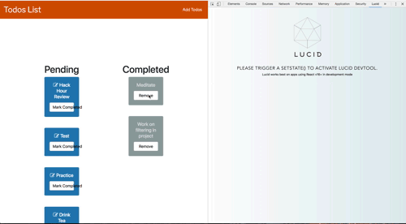
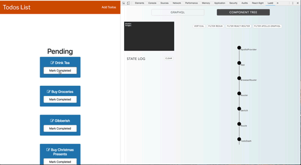
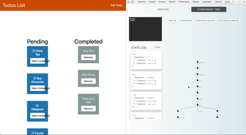
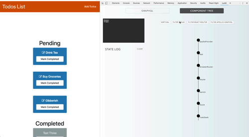

# Lucid
A React-GraphQL developer tool.


Lucid is a React / GraphQL Developer Tool designed for helping developers debug their React applications that depend on GraphQL resources. Lucid devtool allows you to visualize the component hierarchy of your React application and your GraphQL schema, queries, and mutations side by side, making debugging easier.

**IMPORTANT:**  Lucid is in *BETA* mode and works best for React v16+ local projects in development environments. 

### How It Works
*React-Lucid*
Lucid parses through your React app to generate an interactive tree graph representing your React component hierarchy with node-specific state and props data. The tree updates with each change to user app state and displays a log of state diffs on the side. This is done by creating a persistent data bridge to the user application via Chrome background and content scripts. Lucid injects scripts utilizing React DevTool's Global Hook to recursively traverse through the React DOM each time setState is called, resulting in a tree and log that display real-time feedback. Our app itself uses React so as the state of your live app changes, the Lucid tree graph will also provide visual feedback of data flow and state changes through the React components.

*GraphQL-Lucid*
Lucid intercepts HTTP requests using Chrome devtool APIs and GraphQL's schema introspection to display a log of real-time Apollo client/server queries and mutations, along with their GraphQL schema and response objects. This allows full-stack developers to debug their app from the front-end through to the back-end, as requests are generated, flow through the server and back to the DOM. 

### Setup: Install from Chrome Extension Store

1. Install <a href="https://chrome.google.com/webstore/detail/react-developer-tools/fmkadmapgofadopljbjfkapdkoienihi?hl=en">React Developer Tools</a>. 

2. Install <a href="https://chrome.google.com/webstore/detail/debux/ooihnkghpifccalpfakdnlolfaiidfjp?authuser=1">Lucid</a> to your chrome://extensions from the <a href="https://chrome.google.com/webstore/category/extensions">Chrome Web Store</a>.

3. Run your React-GraphQL application or open a site that uses React v16+ or GraphQL.

4. Inspect or open Chrome Developer Tools, and open the Lucid developer tool panel.

5. Have fun!

### Setup: Build your own

1. Clone the repo and install dependendies: 

    ```npm install```

2. Build Lucid: 

    ```npm run build ```

3. In Chrome Browser Settings, click on **More Tools** >> **Extensions** >> click **Load Unpacked**

4. Navigate to your local Lucid directory and select the folder './react-lucid/build'

5. Have fun!


## GraphQL View: Panel GIF displays application Requests, Responses and Schema. 
When opening the Lucid devtool users land on the GraphQL panel and they will receive the ability to see previous requests made as well as reponses and their schemas. 
Note: The devtool only listens for HTTP requests when it's open in the developer tool panel. To see any requests that were made upon initial page load, reload your page after opening the devtool. 



See a chronological log of GraphQL HTTP Requests on the left, and click on each log to view the HTTP response to that particular request. At the bottom of the panel, you'll also see your application's GraphQL schema.

### Component Tree View
In the React panel, see a tree graph representing your React application's component hierarchy. In the top left box, you will see the state and props data of any tree graph component you hover over. Below, you will see a log of state diffs whenever you change trigger setState() in your app.



## Component Tree Panel displays Tree Chart, State/Props Panel and a State Diff Log 
On hover in the Tree Chart renders State and Props in State/Props Panel, State Diff Log tracks each event that is initated in user's application. 
You also have the option to filter out certain higher-order components from your tree graph (e.g. Redux, Apollo-GraphQL and React Router).





## Contributing 

Please feel free to fork this repo and submit pull requests! Lucid is currently in beta release. Also, if you have any requests or suggestions for features, please contact us at gossamer.lucid@gmail.com.

## Coming Soon


## Our Team

Yong-Nicholas Kim (https://github.com/yongnicholaskim)

Nian Liu (https://github.com/nianliu18)

Eterna Tsai (https://github.com/eternalee)

Neyser Zana (https://github.com/neyser95)

## License
MIT
