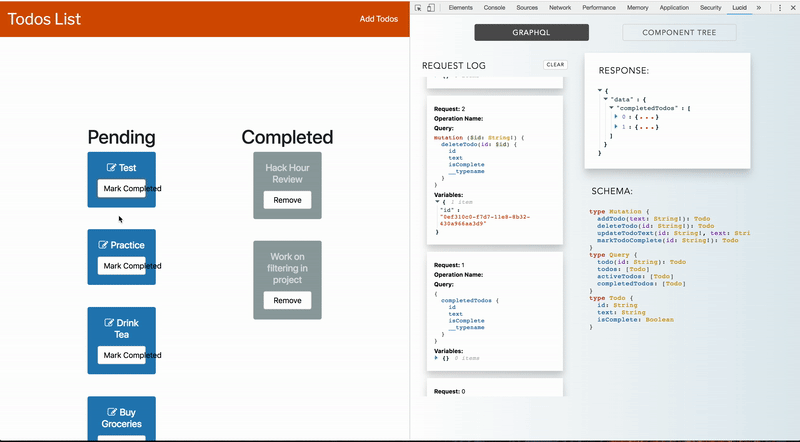
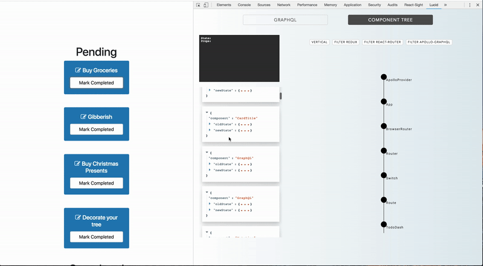
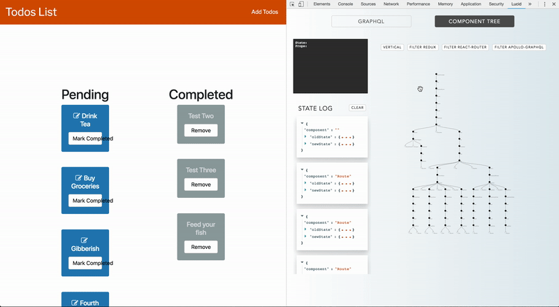

<p align="center">
  
</p>

[](https://twitter.com/intent/tweet?text=Make%20development%20easier%20with%20Lucid.&url=https://github.com/Gossamer-React/Lucid&hashtags=react,graphql,apollographql,javascript,programming,developers,chrome)


## **Lucid**: *a React-GraphQL developer tool*

Lucid is a Chrome Developer Tool designed to help developers debug their React-GraphQL applications. 
- Visualize the component hierarchy, state/props data and state changes of your React application
- See your GraphQL schema, queries, and mutations in real-time

## Underlying Technology
### React Tab
Lucid parses through your React app to generate an interactive tree graph representing your __React component hierarchy__, with node-specific __state and props__ data. The tree updates upon each change to the React app's state, and displays a log of __state diffs__ on the left. This is done by creating a persistent data bridge to the user's React application via the Javascript API for WebExtensions' background and content scripts. Lucid injects scripts utilizing React DevTool's Global Hook to recursively traverse through the React DOM each time setState is called, resulting in a tree and a log that each display real-time feedback. Our app itself uses React internally so as the state of your live app changes, the Lucid tree graph will also provide visual feedback of data flow and state changes through the React components immediately.

### GraphQL Tab
Lucid intercepts HTTP requests using Chrome Devtool APIs to display a log of real-time __Apollo client queries and mutations__, along with associated __response__ objects. Lucid also uses GraphQL schema introspection to display __schema__ information from the server. This allows full-stack developers to debug their app from the front-end to the back-end, as requests are generated, responses are returned from the server, and data flows through React components to be rendered in the DOM. 

## Setup
| Install from Chrome Extension Store  | Build your own extension |
| ------------- | ------------- |
| 1. Install <a href="https://chrome.google.com/webstore/detail/react-developer-tools/fmkadmapgofadopljbjfkapdkoienihi?hl=en">React Developer Tools</a>. | 1. Clone the repo and install dependendies:     ```npm install``` |
| 2. Install <a href="https://chrome.google.com/webstore/category/extensions">Lucid</a> or __Build your own extension__. | 2. ```npm run build ```|
|3. Run your React-GraphQL application or open a site that uses React v16+ or GraphQL.|3. Navigate to chrome://extensions (or in your Chrome Browser Settings, click on **More Tools** >> **Extensions**). |
|4. Open Chrome Developer Tools (Inspect or Cmd+Opt+I / Ctrl+Shift+I) and click on the Lucid panel.|4. Click **Load Unpacked** and select the './react-lucid/build' folder from your local directory.|
|5. Have fun!  |

**IMPORTANT:**  Lucid is in *BETA* mode and works best for React v16+ local projects in development environments. 

## How to Use
### GraphQL View 
* In the GraphQL panel, a chronological log of API __requests__ is shown on the left. 
* A GraphQL __schema__ of all available types, queries, and mutations is also automatically fetched from the GraphQL server when Lucid is initialized and displayed on the bottom.
* Click each request log to see its associated HTTP __response__. 
 
**NOTE:**  Lucid only listens for HTTP requests while it is open in the Chrome Developer Tool panel. To see any requests that were made upon initial page load, reload your React page after opening Lucid in your Chrome browser. 

 

### React (Component Tree) View
* In the React panel is a tree graph representing your application's __component hierarchy__. 
* Hovering over any React Component in the tree displays the __state and props data__ of that component in the top left.
* The __State Diff__ Log tracks changes in state whenever setState() is triggered.
* Filter out specified higher-order components from your tree graph (e.g. Redux, Apollo-GraphQL, and React Router) by clicking the buttons.






## Contributing 

Lucid is currently in beta release. Please let us know about bugs and suggestions at gossamer.lucid@gmail.com. Feel free to fork this repo and submit pull requests! 

## Coming Soon


## Team

Yong-Nicholas Kim (https://github.com/yongnicholaskim)

Nian Liu (https://github.com/nianliu18)

Eterna Tsai (https://github.com/eternalee)

Neyser Zana (https://github.com/neyser95)

## License
MIT
